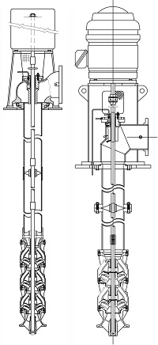
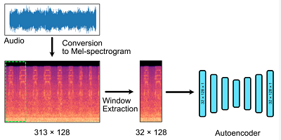

# Table of Contents

1.  [Title <code>[1/1]</code>](#orgad68038)
2.  [Abstract <code>[1/1]</code>](#org72429f1)
3.  [Index Terms <code>[1/1]</code>](#org3ea14eb)
4.  [Introduction <code>[6/6]</code>](#org60810a8)
5.  [Background <code>[5/5]</code>](#orgd56e8c0)
6.  [Methods & Materials <code>[0/0]</code>](#orge82f733)
    1.  [General ML Workflow <code>[0/3]</code>](#org27a5b2e)
    2.  [Specific ML Workflow <code>[0/3]</code>](#org4653f6b)
    3.  [Specific Analysis Methods <code>[0/4]</code>](#org1e396e7)
7.  [Results](#orgb1ff7ad)
8.  [Discussion](#org904e8df)
9.  [Conclusion](#org7939492)
10. [Appendix](#orgdf1d628)
11. [Bibliography](#orge9330b1)

# Title <code>[1/1]</code>

-   [X] Content

    A proposed automatic in-situ acoustic anomaly detection method for the condition monitoring of remote vertical turbine pump stations

# Abstract <code>[1/1]</code>

-   [X] Content

    The condition monitoring of vertical turbine pump stations, found on large irrigation systems in remote areas presents a number of challenges that make it well suited for emerging techniques in the fields of machine learning, embedded systems, and machine condition monitoring.  Such pump stations employ arrays individual vertical turbine pumps, capable of individual or combined operation, are often remotely located, remotely controlled, serve mission critical roles to both private and public interests, and are very costly to repair in both time and labor.  Further, besides high repair costs due to machine break downs, even more financially costly are small degradations of efficiency in otherwise normal operation.  Unchecked, such variations represent tens of thousands of dollars in avoidable losses.  Given access to real-time, remotely accessible, and relatively accurate machine condition monitoring data; operators could both schedule predictive maintenance as well as factor in relative pump to pump efficiencies when responding for variable water demand down stream of the pump station.
    
    As almost all such systems are operated via programmable-logic-controllers, most such systems already have some degree of condition monitoring feedback built into them.  Most commonly found are feedback inputs reflecting amperage draw, frequency, voltage, temperature, rpm, and in some cases fluid flow.  The size and remoteness of these systems makes many common machine condition monitoring methods unfeasible.  Methods such as vibration analysis,
    
    What we propose here is an automatic system that can be installed near, but not interfere with, such pump stations, outside of the control loop, which can monitor for and report on operation anomalies through the detection of acoustic anomalies during station operation.

# Index Terms <code>[1/1]</code>

-   [X] Content

    Acoustic emission, Anomaly detection, Machine learning, Condition monitoring, Real-time, Signal Processing, Spectrogram, Acoustic signal processing, Embedded systems, 

# Introduction <code>[6/6]</code>

-   [X] **A:** Role of Irrigation

    Since the begining of recorded time, the life blood of any human civilization has always been linked to water.  Since long before the basin irrigation of Ancient Egypt or canal networks of the early Mesopotamians, there has been a continuous need to both improve existing and develop new technologies for transporting water.  Irrigation, the supply of water to land for the purpose of growing crops, has been an especially forceful driver of improvements and new innovations.  Almost all modern irrigation processes begin with the need to lift volumes of water from lower elevations to high elevations; whether for immediate use, reservoir storage, or to leverage gravity to build pressure.

-   [X] **B:** Modern Large Scale Irrigation

    Today much of that lifting work is done through the use of Vertical Turbine Pumps.  A vertical turbine pump is a type of centrifugal pump built to be submerged in water \cite{scherer1993irrigation}, are driven by direct mounted electric motors, and capable of lifting large volumes of water at greater efficiencies than traditional centrifugal pumps.  Vertical turbine pumps can be found in many different sizes and applications.  Because of their efficency, almost all large scale irrigation systems rely on vertical turbine pump technology.

-   [X] **C:** Vertical Turbine Pumps

[[]]

    A single Vertical turbine pump consists of the following elements, typically found from bottom (input) to top (output): a suction filter or screen, a series of pump stages called the bowl assembly, the column assembly, and finally the head assembly.  Mounted atop the head assembly is an electric motor.  The motor is coupled to a drive shaft that extends the full length of the column and bowl assemblies.  This drive shaft turns the impellers housed inside the bowls of the bowl assemby.  The number of bowl assemblies varies depending on purpose and design of the system.  The electric motors atop the pumps are typically connected to a variable frequency drive, which is itself most often connect to a programmable logic controller.  A typical VFD & PLC installation will often provide a number of feedback parameters for use by the operators.  At a minimum, operators usually have visibility on amerage draw, voltage, line frequency, and motor rpm.  Depending on installation, additional monitoring parameters may include fluid flow, temperature measurements, and pressure readings.  Vertical turbine pumps can be run individually or in tandem within a large array of such pumps.

-   [X] **D:** Multi Unit Pump Stations

[[]]

    A vertical turbine pump station represents a system in which multiple vertical turbine pumps are linked together.  These stations draw input water from the same source, and combine the outputs into a common manifold or reservoir depending on design.  During operation, depending on demand, the number of pumps engaged may range from all, to some, or even just one.  These pump stations are usually very large, remotely located, and quite loud when in full operation.  As crop growing cycles are inflexibly linked to annual cycles, and absence of water can permanently alter soil conditions not just reduce crop growth; uptime availability of these systems is considered extremely critical.  Standard operating procedures involve predictive maintenance and rebuilds of individual pumps during non-growing seasons.  Year to year, the operators of these systems will select a number of pumps to be removed and sent to machine shops that specialize in the teardown, inspection, repair, re-assembly, testing, and installation of such pumps.  The down time for a full rebuild is typically measured in months.  Even when scheduled in advance, the rebuild process is time consuming and costly.

-   [X] **E:** The Problem

    The problem this paper seeks to address is that the operators of such systems have limited information on the relative condition of their pumps, both individually and as systems.  As stated above, most of the typical feedback parameters come from the VFD's or the PLC's.  Feedback from these devices is typically found within the PLC control network itself.  Sometimes additional sensing devices such as flow meters, pressure transducers, and thermocouples are also incorporated.  The information provided by these auxiliary devices is typically segregated from the PLC control network.  The goal of this paper is to demonstrate a system that by continuosly observing sound emissions from such pump stations a properly trained machine learning algorithm could report and log acoustic anomalies that the operators could utilize in both planning maintenance as well as factor into regular operation procedures.

-   [X] **F:** Proposed Solution

    Detection and recognition are two different applications of machine learning often requiring different algorithms as well as specially labeled data sets.  They can though be built on shared archictecture if planned early on in the process.  Typically, detection is a binary classification where recognition is more often a multiclass classification.  An example of detection use in vertical pump stations would be logging whether sound current acoustic emissions are likely within expected ranges or outside of expected ranges.  Likewise, a possible recognition algorithm may attempt to classify detected anomalies as being within such categories as: cavitation, bearing wear, debri ingest, or other mechanical failure.

# Background <code>[5/5]</code>

-   [X] **A:** General Overview MCM

    There are a number of modern approaches to machine condition monitoring.  In terms of machine condition monitoring, these pump stations represent a family of rotating machinery, that cannot be easily moved or disassembled, must be kept in production as much as possible, and are subject to harsh operating conditions.
    The minimum selection criteria for this project requires that any method used must be\newline
    
    \begin{enumerate}
    \item Non-destructive
    \item In-situ
    \item PLC safe
    \item Harsh environment
    \item Minimal installation effort \newline
    \end{enumerate}
    
    Based on that criteria some available technologies include vibration analysis, electrical performance analysis, hydraulic monitoring (flow, pressure, temperature), visual analysis, and acoustic analysis.  The oil and gas industry has developed a number of ultrasonic technologies that can be used to identify the location and propogation of cracks in piping.  The power transmission industry has developed a number of both vibration based and tribology (oil analysis) based methods for monitoring rotating machinery.  Also the aerospace industry has contributed a number of technologies in acoustic sensing such as special microphones used on aircraft during flight testing or in wind-tunnel tests.

-   [X] **B:** Acoustic Machine Learning

    While there exist many proven machine learning methods for anomaly detection, most of those proven methods are built for visual data.  Acoustic data represents a special challenge when attempting to build a machine learning model on it.  One alternative to dealing with native acoustic data to transform it's representation from purely acoustic to a series of image representations.  [ADD CITATION].  One promising approach has been to convert the recorded audio data into Mel-spectrogram visualization of the sound data and then apply conventional image based machine learning methods on these image representations.  The process take the original time-domain recording, applies a Fourier transform on the data to create a frequency-domain representation, discretize the bins from the Fourier transform process into Mel scale filterbanks for human centric perception, convert to log scale, smooth the bin data with a triangular filter, apply an RGB color to the bin values, and finally reassemble them into individual raster image files that will then comprise a new dataset of the acoustic signal but in a visual representation.  These visualized datasets can then be worked on using the same machine learning and deep learning methods already established in the image domain.

[[]]

-   [X] **C:** Anomaly Detection

    While conventional classification algorithms rely on large training and testing datasets of pre-labeled data, anomaly detection differs in that rather than looking for a match to something it knows; it's looking for a deviation from something known.  Successive deviations may not be related, have been 'seen' before, or even stored and learned from.  One approach testing for deviation has been the development of deep autoencoders (AE).  From [muller2020acoustic] "An AE is a neural network (NN) that first compresses its input into a low dimension representation and subsequently reconstructs the input.  The reconstruction error is taken as the anomaly score since it is assumed that input differing from the training data cannot be reconstructedly precisely".  While the AE principle does work, it also begins to break down on high dimensionality inputs, such as images, due to the curse of dimensionality.  In typical image domain machine learning this is often dealt with by reducing the dimensionality of the input data by lowering the image resolution, lowering the color depth, or reducing the size of each image representation.  Such dimensionality reduction would cause significant loss to our already transformed acoustic signal data.  As an alternative to image degredation, it has been show that deep learning convolutional neural networks (CNN) can be utilized to extract meaningful features from the data first; then with these lower dimensional extracted features, we can build a more stable anomaly detection model while also keeping the input signal as close to the original input as possible.

[[]]

-   [X] **D:** Embedded Systems

    Most of the work in acoustic anomaly detection is still being produced in lab environments in which compnutation power is often not a limiting factor.  In this project though, our intended deployment immediately forces computational constraints on the process from the very begining.  In order to deploy an automatic system to a production environment that is remotely located, exposed to harsh weather, has limited power availability, and no guarantee of network up-time; the entire model from end to end needs to be one that can consistently operate on a small computational footprint.  Established in 2019, TinyML is a foundation that has taken interest in developing "machine learning architectures, techniques, tools, and approaches capable of performing on-device analytics... at low power.".  Groups such as TinyML have made a number of very recent gains in the use of small devices running on-board machine learning models.  Such a device would be the best choice for a deployment as our.  In particular, microcontrollers (MCU) have been shown to perform nearly as well as CPU based devices.  In some cases MCU's have outperformed small CPU based devices in small IoT / ML deployments.  

[[]]

# Methods & Materials <code>[0/0]</code>

-   <https://cloud.google.com/ai-platform/docs/ml-solutions-overview>
-   <https://ml-ops.org/content/end-to-end-ml-workflow#:~:text=The%20core%20of%20the%20ML,to%20train%20an%20ML%20model>.
-   <https://www.datacamp.com/blog/a-beginner-s-guide-to-the-machine-learning-workflow>
-   <https://cms.tinyml.org/wp-content/uploads/talks2020/tinyML_Talks_Ian_Campbell_201208.pdf>
-   <https://www.mdpi.com/2079-9292/10/19/2329>

## General ML Workflow <code>[0/3]</code>

-   [ ] Data Engineering

   

    [GENERAL DATA CONTENT]
    Recently attempts have been made to standardize the flow of work when starting a machine learning project.  

-   [ ] Model Engineering

    [GENERAL MODEL CONTENT]

-   [ ] Model Deployment

    [GENERAL DEPLOY CONTENT]

## Specific ML Workflow <code>[0/3]</code>

-   [ ] **Data:** Specific Methods
    -   [ ] **Hardware:** Signal Capture
        -   [ ] choose transducer (microphone(s))
        -   [ ] choose recording hardware (multi channel, SoC, small device, &#x2026;)
        -   [ ] mounting?
        -   [ ] power supply?
        -   [ ] networking?
    -   [ ] **Software:** Signal Manipulation
        -   [ ] Signal storage?
        -   [ ] Signal conditioning? (trimming, cleaning, filtering)
        -   [ ] Signal conversion? (convert audio to graphical spectrograms, circular plots?)

    This project will leverage the data collected as part of the 2020 Detection and Classification of Acoustic Scenes and Events (DCASE) challenge.  The DCASE challeng is an annual challenge organized by Queen Mary University of London (QMUL).  Since 2013, every year (except for a 2 year hiatus) a new challenge in environmental sound classification has been presented for public competition.  Task #2 of the 2020 DCASE challenge was to develop a method for the "Unsupervised Detection of Anomalous Sounds for Machine Condition Monitoring".  The dataset compiled for this task was comprised of parts of two earlier datasets, the ToyADMOS and MIMII datasets.  This dataset is now known as the DCASE2020 dataset and is provided in three parts; development data, training data, and evaluation data.
    
    The DCASE2020 dataset consists of recordings of both nominal and anomalous operating sounds of six different types of machines; Toy-car, Toy-conveyor, Valves, Pumps, Fans, and Slide rails [cite].  Each sample is a 10 second long recording over a single audio channel that include both the machine's target sound and environmental noise.
    
    The recordings from the ToyADMOS dataset were captured using four microphones and those from the MIMII dataset were captured using eight microphones.  The sampling rate of each recording has been downsampled to 16 kHz.  Each machine type has 3-4 representitive Machine ID's.  In the development data set,each Machine ID, there consists of around 1,000 samples of nominal operation for training and 100-200 samples of anomalous sounds [cite, dcase2020 url].  In the evaluation dataset the number of test samples for each machine ID is around 400.
    
    The DCASE2020 dataset will also serve as a model for constructing real world data acquisition of vertical turbine pump stations.  That is, the recording will be done with between 4 to 8 microphones, span around 10 seconds each, and though recorded at higher frequencies, be downsampled to 16 kHz just as the DCASE recordings are.

-   [ ] **Model:** Specific Methods
    -   [ ] Algorithm&#x2026;

    [SPECIFIC MODEL METHODS CONTENT]

-   [ ] **Deployment:** Specific Methods
    -   [ ] **HMI:** End user interaction&#x2026;

    [SPECIFIC DEPLOY METHODS CONTENT]

## Specific Analysis Methods <code>[0/4]</code>

-   [ ] Discuss Pass / Fail threshold (acceptable false alarms rate)
-   [ ] Discuss Metrics (AUC, ROC, Confusion Matrix, etc)
-   [ ] Discuss Trial & Error, Iterations,
-   [ ] Discuss End User Interaction, HMI ?

# Results

# Discussion

# Conclusion

# Appendix

# Bibliography

